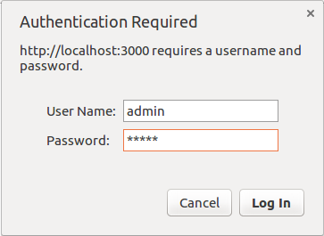
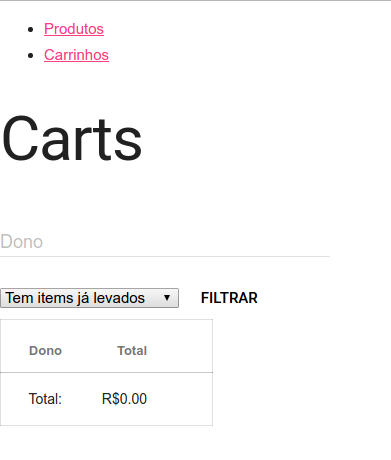

# Bazar Cart

Carrinho de compras pra ajudar no seu bazar.

## Como rodar

O carrinho de compras foi desenvolvido em Ruby on Rails, pra rodar você precisa:

- Instalar o [RailsInstaller](http://railsinstaller.org/) (recomendo o Ruby 2.2);
- Clicar no arquivo `install.bat`;
- Esperar a mensagem `"Deu tudo certo"` e pressionar qualquer tecla pra fechar a linha de comando;
- Clicar no `start.bat`;
- Esperar o servidor terminar de carregar; deve aparecer uma mensagem tipo essa:
```
=> Booting Puma
=> Rails 5.0.0.1 application starting in development on http://localhost:3000
=> Run `rails server -h` for more startup options
Puma starting in single mode...
* Version 3.6.2 (ruby 2.2.3-p173), codename: Sleepy Sunday Serenity
* Min threads: 5, max threads: 5
* Environment: development
* Listening on tcp://localhost:3000
Use Ctrl-C to stop
```
- Abrir no seu browser o link [http://localhost:3000](http://localhost:3000);
- O site vai te pedir usuário e senha, ambos são `admin` (se quiser mudar, entra em contato comigo):





- Finalmente, deve aparecer uma tela como essa abaixo:




E é isso! Divirta-se no seu bazar! :D
